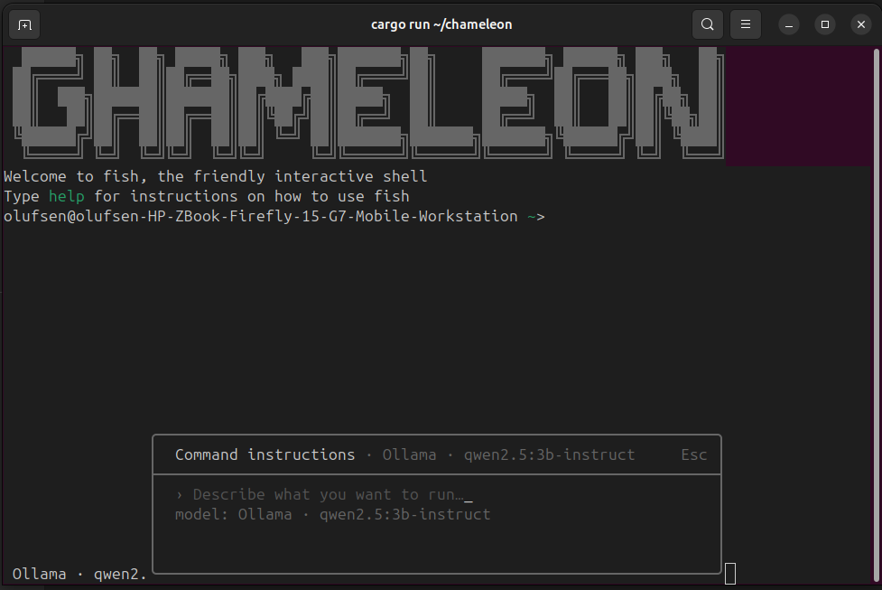

<div align="center">

```
 ██████╗██╗  ██╗ █████╗ ███╗   ███╗███████╗██╗     ███████╗ ██████╗ ███╗   ██╗
██╔════╝██║  ██║██╔══██╗████╗ ████║██╔════╝██║     ██╔════╝██╔═══██╗████╗  ██║
██║     ███████║███████║██╔████╔██║█████╗  ██║     █████╗  ██║   ██║██╔██╗ ██║
██║     ██╔══██║██╔══██║██║╚██╔╝██║██╔══╝  ██║     ██╔══╝  ██║   ██║██║╚██╗██║
╚██████╗██║  ██║██║  ██║██║ ╚═╝ ██║███████╗███████╗███████╗╚██████╔╝██║ ╚████║
 ╚═════╝╚═╝  ╚═╝╚═╝  ╚═╝╚═╝     ╚═╝╚══════╝╚══════╝╚══════╝ ╚═════╝ ╚═╝  ╚═══╝
```

### A minimal, AI-powered terminal emulator written in Rust




</div>

---

## Intro

**Chameleon** is a terminal emulator that runs your shell in a real PTY, parses escape sequences with VTE, and renders with crossterm. It adds **AI command suggestions** at `Ctrl+K`: type in plain English and get a shell command. Use it as your daily terminal or as a secondary one—install with a single command and choose how you want it.

---

## What problem it solves

- **No more tab‑switching for AI** — Get command suggestions and natural-language-to-shell help inside the terminal instead of opening a browser or another app.
- **Forget fewer commands** — Fish-style ghost suggestions (history first, then AI) and prefix search over your shell history so you can repeat or tweak commands without memorizing.
- **One terminal that adapts** — Minimal by default, no web UI or account; theme and AI backend live in a single config file you can edit and reload on the fly.
- **Easy to try** — One-command install, no package manager or Rust required; pick “primary” (default terminal) or “secondary” when you run the installer.

---

## Features

|     | Feature                   | Description                                                                            |
| --- | ------------------------- | -------------------------------------------------------------------------------------- |
| 🔌  | **PTY + Shell**           | Spawns your shell (Unix: `$SHELL`/`/bin/sh`; Windows: `cmd.exe`) in a real PTY with full signal support |
| 🤖  | **AI Command Bar**        | Press `Ctrl+K` — type English, get a shell command. Ollama, OpenAI, Gemini, or Groq    |
| 💬  | **Autosuggestions**       | Fish-style ghost text: history-first, then AI. Accept with Tab / Right / End           |
| 🎨  | **VTE Parsing**           | Cursor movement, colors, bold, erase, scroll, CSI/ESC sequences                        |
| 📐  | **Dynamic Resize**        | Window resize updates PTY size and redraws the screen seamlessly                       |
| 📋  | **Mouse Copy**            | Click-drag to select; double-click word, triple-click line; auto-copy to clipboard     |
| 🌈  | **Live Theming**          | Edit `config.toml` and theme reloads instantly via `Ctrl+Shift+T`                      |
| 📝  | **Syntax highlighting**   | First word of the command line highlighted (e.g. command name in cyan)                 |
| ⚙️  | **File-based config**     | `~/.config/chameleon/config.toml` for theme + AI; open with `Ctrl+Shift+T`             |
| ⌨️  | **Smart tab completions** | Tab / Right / End = accept full suggestion; `Ctrl+Right` = accept one word             |
| 🚀  | **No config required**    | Works out of the box; config is optional                                               |
| 📜  | **Extensive history**     | Prefix search over shell history (bash/zsh/fish), newest first, deduped                |
| 📌  | **Abbreviations**         | Type abbrev + space to expand (e.g. `gco ` → `git checkout `, `gst ` → `git status `)  |

---

## How to install easily

### One command _(recommended)_

No Rust or package managers. One command downloads the right binary for your OS.

**Linux & macOS**

```bash
curl -sSL https://raw.githubusercontent.com/Haroon966/Chameleon/main/install.sh | sh
```

- Installs to `~/bin` (if in PATH) or `/usr/local/bin`.
- Asks: **Primary** (desktop entry, optional `update-alternatives` on Linux) or **Secondary** (just the binary).

**Windows (PowerShell)**

```powershell
irm https://raw.githubusercontent.com/Haroon966/Chameleon/main/install.ps1 | iex
```

- Installs to `%LOCALAPPDATA%\Programs\Chameleon` and optionally adds it to your user PATH.

Overwrite existing install: Linux/macOS use `-f`: `curl -sSL .../install.sh | sh -s -f`.  
To use another repo set `CHAMELEON_GITHUB_REPO=owner/repo` (or `$env:CHAMELEON_GITHUB_REPO` on Windows).

### Manual: prebuilt binary

1. Download the archive for your platform from [Releases](https://github.com/Haroon966/Chameleon/releases).

2. **Linux / macOS:** Extract and put the binary in your PATH:

```bash
tar -xzf chameleon-*.tar.gz
mv chameleon-*/chameleon ~/bin/
# or: mv chameleon-*/chameleon /usr/local/bin/
```

3. **Windows:** Extract the `.zip`, then copy `chameleon.exe` to a folder that is in your PATH (e.g. create `%LOCALAPPDATA%\Programs\Chameleon` and add it to PATH).

### Build from source

Requires Rust (edition 2021).

```bash
git clone https://github.com/Haroon966/Chameleon.git
cd Chameleon
cargo build --release
# Run: ./target/release/chameleon (Unix) or target\release\chameleon.exe (Windows)
```

---

## Credit

Chameleon is built with:

- **[Rust](https://www.rust-lang.org/)** — language and toolchain
- **[crossterm](https://github.com/crossterm-rs/crossterm)** — terminal I/O, raw mode, display, mouse
- **[portable-pty](https://github.com/nicowilliams/portable-pty)** — cross-platform PTY
- **[vte](https://github.com/alacritty/vte)** — ANSI/VT100 escape sequence parsing
- **AI backends** — [Ollama](https://ollama.ai), OpenAI, Google Gemini, Groq (optional)

---

## License

Personal and non-commercial use is **free**.  
Modification, rebranding, and resale require **written permission** from the copyright holder.

See [LICENSE](LICENSE) in the project root.

---

## Key bindings

### Chameleon shortcuts

| Shortcut                | Action                                   |
| ----------------------- | ---------------------------------------- |
| `Ctrl` + `K`            | Open AI command bar                      |
| `Ctrl` + `Shift` + `T`  | Open config in `$EDITOR`, reload on save |
| `Ctrl` + `Shift` + `C`  | Copy selection to clipboard              |
| `Tab` / `Right` / `End` | Accept full ghost suggestion             |
| `Ctrl` + `Right`        | Accept one word of ghost suggestion      |

### Abbreviations (type then space)

| Abbrev        | Expands to      | Abbrev     | Expands to    |
| ------------- | --------------- | ---------- | ------------- |
| `gco `        | `git checkout ` | `gpush `   | `git push `   |
| `gst `        | `git status `   | `gpull `   | `git pull `   |
| `gci `        | `git commit `   | `gmerge `  | `git merge `  |
| `gbr `        | `git branch `   | `gfetch `  | `git fetch `  |
| `glog `       | `git log `      | `gshow `   | `git show `   |
| `gdiff `      | `git diff `     | `grebase ` | `git rebase ` |
| `gadd `       | `git add `      | `greset `  | `git reset `  |
| `ll ` / `la ` | `ls -la `       |            |               |

### Shell signals

| Shortcut     | Action                         |
| ------------ | ------------------------------ |
| `Ctrl` + `C` | Send `SIGINT` (interrupt)      |
| `Ctrl` + `Z` | Send `SIGTSTP` (suspend)       |
| `Ctrl` + `D` | Send `EOF` (often exits shell) |
| `Ctrl` + `\` | Send `SIGQUIT`                 |
| `Esc`        | Dismiss AI bar / pickers       |

Standard keys (arrows, Tab, Enter, Backspace, Home, End, Page Up/Down, Delete, Insert) are passed through to the shell.

### Mouse

| Action                  | Result                 |
| ----------------------- | ---------------------- |
| Click + drag            | Stream selection       |
| Double-click            | Select word            |
| Triple-click            | Select whole line      |
| Release after selecting | Auto-copy to clipboard |

---

## AI command bar

`Ctrl+K` → type your prompt → Enter to run · Esc to dismiss

**Example:**

```
❯ ~/projects  ^K
┌─────────────────────────────────────────────────┐
│ 🤖  find all rust files modified in last 7 days │
└─────────────────────────────────────────────────┘
  ➜  find . -name "*.rs" -mtime -7 -type f
     [Enter to run · Esc to dismiss]
```

- **Switch models:** Type `/model` or `/models` in the AI bar to choose backend (Ollama, OpenAI, Gemini, Groq) and model.
- **API keys:** Use “Configure API” or “Remove API” from inside the AI bar.

---

## Configuration

**Location:** `~/.config/chameleon/config.toml` (or `$XDG_CONFIG_HOME/chameleon/config.toml`)

The file is created the first time you press `Ctrl+Shift+T`. Save and exit — theme reloads immediately.

```toml
[theme]
default_foreground = "#cccccc"
default_background = "#1e1e1e"
background_opacity = 0.95
font_size          = 14

[ai]
backend  = "ollama"
base_url = "http://127.0.0.1:11434"
model    = "llama3.2:latest"

[ai.providers.openai]
api_key = "sk-..."

[ai.providers.gemini]
api_key = "..."

[ai.providers.groq]
api_key = "..."
```

**Theme:** `default_foreground`, `default_background` (hex), `background_opacity` (0–1), `font_size` (6–72).  
**AI:** Set `backend`, `base_url` (Ollama), `model`. Prefer env vars: `OPENAI_API_KEY`, `GEMINI_API_KEY`, `GROQ_API_KEY`.

---

## Architecture & dependencies

**Thread model:** Main thread (crossterm raw mode, keyboard, resize, writes to PTY) and reader thread (reads PTY, VTE parser, screen buffer, redraw). Resize updates PTY size and triggers full redraw.

**Crates:** `crossterm` (I/O, display, mouse), `portable-pty` (PTY), `vte` (escape parsing), `arboard` (clipboard), `ureq` + `serde_json` (AI HTTP), `serde` + `toml` (config), `directories` (XDG config path).

---

## Requirements

| Requirement           | Details                                                                          |
| --------------------- | -------------------------------------------------------------------------------- |
| **Platform**          | Linux, macOS, or Windows (x86_64)                                                |
| **AI** _(optional)_   | [Ollama](https://ollama.ai) with a model, or API key for OpenAI, Gemini, or Groq |
| **Build from source** | Rust edition 2021                                                                |

---

<div align="center">

**Chameleon — A terminal that adapts to you**

_Built in Rust · PTY + VTE + crossterm_

</div>
