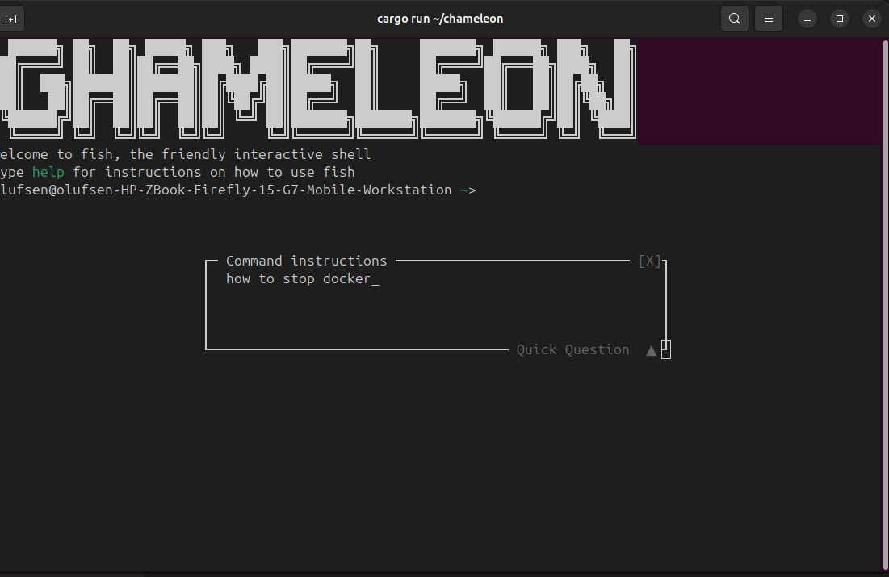

# Chameleon

A minimal terminal emulator written in Rust.



It runs your shell in a PTY, parses escape sequences with the VTE library, and renders output using crossterm.

## Install

Download the binary for your platform from [Releases](releases). No other software (Rust, package managers, etc.) is required.

Example (Linux/macOS): extract the tarball and put the `chameleon` binary in a directory in your `PATH`:

```bash
tar -xzf chameleon-*.tar.gz && mv chameleon-*/chameleon ~/bin/
```

(Replace `~/bin/` with `/usr/local/bin` or another directory in your `PATH` if you prefer.)

## Features

- **PTY + shell** — Spawns your `$SHELL` (or `/bin/sh`) in a pseudo-terminal
- **VTE parsing** — Handles cursor movement, colors (8 standard), bold, erase, scroll, and common CSI/ESC sequences
- **Keyboard input** — Arrow keys, Tab, Enter, Backspace, Ctrl+C/Z/D, and other typical bindings
- **Resize** — Window resize updates the PTY size and redraws the screen
- **Copy** — Select text with the mouse (click and drag), then **Ctrl+Shift+C** to copy to the system clipboard
- **Theme** — Edit text color, background color, opacity, and font size via a config file; **Ctrl+Shift+T** opens the config in `$EDITOR` and reloads the theme on save
- **AI commands** — **Ctrl+K** opens an AI bar: type a natural-language prompt and get a suggested shell command (via local Ollama). **Enter** injects and runs it; **Esc** dismisses.

## Requirements

- Rust (edition 2021)
- A Unix-like environment (Linux, macOS) for PTY support
- For AI commands: [Ollama](https://ollama.ai) running locally with at least one model (e.g. `ollama pull llama3.2`)

## Build & Run

```bash
cargo build --release
cargo run
```

Or run the release binary directly:

```bash
./target/release/chameleon
```

Exit by closing the shell (e.g. `exit` or Ctrl+D) or terminating the process.

## Copy

- **Select**: Click and drag with the left mouse button to select a rectangular region (shown highlighted).
- **Copy**: Press **Ctrl+Shift+C** to copy the selection to the system clipboard.

## Theme and text size

To configure the theme (text color, background color, opacity) and text size, edit the config file:

- **Config file**: `~/.config/chameleon/config.toml` (or `$XDG_CONFIG_HOME/chameleon/config.toml`). If the file does not exist, Chameleon uses built-in defaults until you create it.
- **Quick edit**: Press **Ctrl+Shift+T** inside Chameleon to open the config file in your `$EDITOR` (or `$VISUAL`, or `nano`). Save and exit; the theme is reloaded and applied immediately.
- **Manual edit**: Create or edit `~/.config/chameleon/config.toml` with the `[theme]` section shown below. Restart Chameleon or press **Ctrl+Shift+T** once to load the file.

Example `config.toml`:

```toml
[theme]
# Default text (foreground) color — hex.
default_foreground = "#cccccc"
# Terminal background color — hex.
default_background = "#1e1e1e"
# 0.0 = fully transparent, 1.0 = opaque (stored for terminals that support it).
background_opacity = 0.95
# Font size in points (hint; many terminals ignore app-set font size).
font_size = 14
```

- **Text color** (`default_foreground`) and **background color** (`default_background`) are applied by the app (hex colors, 24-bit RGB).
- **Text size** is set with `font_size` (in points) in the config. Many host terminals do not let the app change font size; if yours does not, set the font size in your terminal emulator’s settings.
- **Background opacity** (`background_opacity`, 0.0–1.0) is stored in the config. If your terminal ignores it, set transparency in your terminal emulator’s settings.

## AI commands

- **Ctrl+K** — Open the AI bar at the bottom. Type a prompt (e.g. “list files in /tmp by size”), press **Enter**. After the model responds, press **Enter** to inject and run the suggested command in the shell, or **Esc** to dismiss.

AI uses **Ollama** by default. Ensure Ollama is running (`ollama serve` or start the Ollama app) and at least one model is pulled (e.g. `ollama pull llama3.2`). Optional config in `config.toml`:

```toml
[ai]
model = "llama3.2:latest"   # optional; default is first available model
base_url = "http://127.0.0.1:11434"   # optional; Ollama API URL
```

## Architecture

- **Main thread** — Crossterm raw mode and alternate screen; event loop for keyboard and resize; writes input to the PTY master; redraws from a shared screen buffer when dirty or on timeout.
- **Reader thread** — Reads from the PTY master, feeds bytes into `vte::Parser`, which updates the shared screen buffer via a `Perform` implementation, then triggers a redraw.
- **Resize** — PTY size is updated and the screen buffer is resized and redrawn.

## Dependencies

| Crate          | Role                                   |
| -------------- | -------------------------------------- |
| `crossterm`    | Terminal I/O, raw mode, display, mouse |
| `directories`  | Config path (`~/.config/chameleon`)     |
| `portable-pty` | Cross-platform PTY                     |
| `serde` / `toml` | Theme config parsing                 |
| `vte`          | ANSI/VT escape parsing                 |
| `arboard`      | System clipboard for copy               |
| `ureq` / `serde_json` | Ollama API for AI command generation |

## License

See [LICENSE](LICENSE) in the project root. Use is free for personal and non-commercial use; modification, rebranding, and resale require written permission from the copyright holder.
